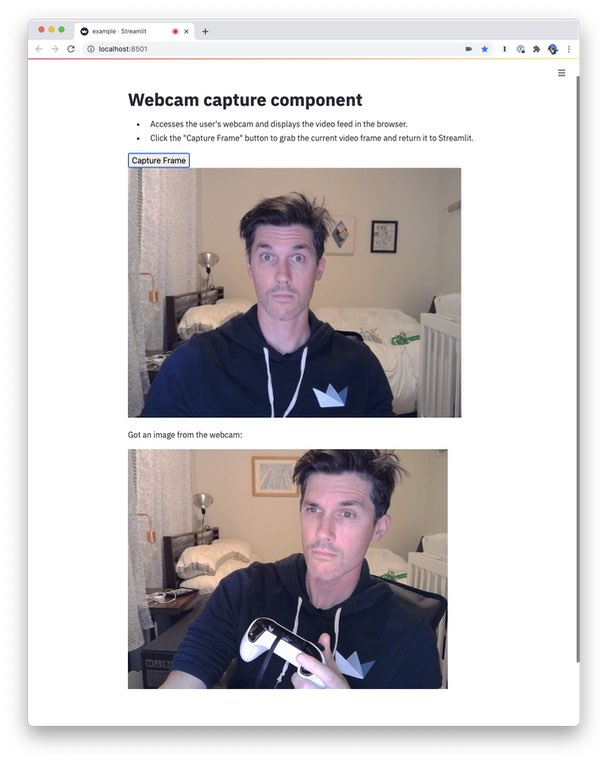

# streamlit-webcam 

An example Streamlit Component. Displays a webcam video feed and receives
webcam snapshots.

## Usage

```python
import streamlit as st
from webcam import webcam

captured_image = webcam()
if captured_image is None:
    st.write("Waiting for capture...")
else:
    st.write("Got an image from the webcam:")
    st.image(captured_image)
```

